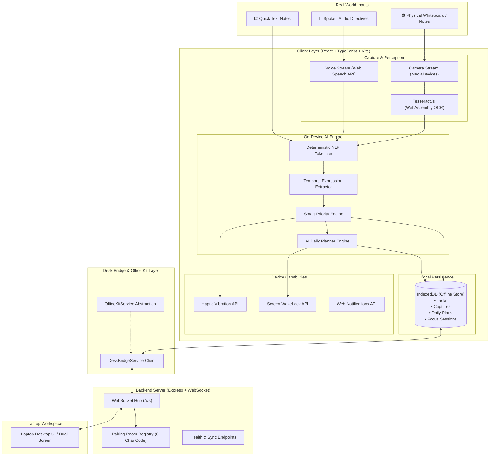

# Snap2Done AI — System Architecture

## Architecture Overview
Snap2Done AI implements a **phone-first, local-first hybrid architecture**. The system is engineered to guarantee zero data loss, offline capability, high responsiveness, and zero reliance on proprietary cloud LLM APIs for core task extraction.

---

## Detailed Component Specifications

### 1. Perception & OCR Engine (`ocrService.ts`)
- **Engine:** Tesseract.js running compiled WebAssembly inside a dedicated Web Worker thread.
- **Language Models:** English LSTM neural net weights (`eng.traineddata`), cached locally in IndexedDB / CacheStorage.
- **Preprocessing:** Canvas bilinear smoothing, contrast adjustment, and dynamic thresholding to maximize handwritten and whiteboard recognition accuracy.
- **Execution:** 100% on-device. Images never leave the client's local memory.

### 2. On-Device Local NLP & Priority Engine (`localNLP.ts`, `localAIModel.ts`)
- **Parsing Strategy:** Hybrid deterministic rule matching and semantic tokenization.
- **Temporal Entity Extraction:** Regular expression and lexical pattern recognizers identifying:
  - Relative tokens: `"today"`, `"tomorrow"`, `"tonight"`, `"next week"`.
  - Specific days: `"monday"`, `"wednesday"`, `"friday"`.
  - Explicit times: `"10 AM"`, `"14:00"`, `"5pm"`, `"due by 6"`.
- **Dynamic Priority Scoring:**
  $$P_{score} = f(\Delta t_{deadline}, \text{effort}, \text{category}, \text{urgency\_tokens})$$
  - $\Delta t \le 28h$: Automatically escalates to `🔥 HIGH`.
  - $\Delta t \le 72h$ with duration $\ge 60m$: Evaluated as `🔥 HIGH`.
  - Generates human-readable, non-hardcoded rationales explaining the exact criteria used.

### 3. AI Daily Planner Engine (`plannerEngine.ts`)
- Implements a greedy constraint-satisfaction schedule algorithm.
- Binds user availability (starting at 09:00), prioritizes pending tasks by weight, respects task duration bounds (capped at 120m per block), and injects mandatory 15-minute breaks and lunch recharge periods.

### 4. Phone ↔ Laptop Desk Bridge (`deskBridgeService.ts`, `server/src/index.ts`)
- **Protocol:** Bidirectional WebSocket communication over `/ws` with HTTP REST fallback.
- **Pairing Protocol:**
  1. Laptop client requests pairing session (`POST /api/bridge/create`).
  2. Server generates a cryptographically random 6-character room code (e.g., `L8EQ56`) and room identifier.
  3. Laptop presents a high-resolution QR code (`qrcode.react`) and room code.
  4. Phone inputs or scans the room code (`POST /api/bridge/join`).
  5. Both devices upgrade to WebSocket connections and join the shared room.
  6. Mutations on either device (`TASK_CREATED`, `TASK_UPDATED`, `TASK_DELETED`) are broadcast to peers with $< 50\text{ms}$ latency.

### 5. Office Kit Abstraction Layer (`officeKitService.ts`)
- Decouples UI logic from physical hardware peripherals.
- Standardizes hardware profiles: `undocked`, `docked_stand`, `paired_bridge`.
- Prepared for future hardware desk pad SDK integrations without requiring application architectural rewrites.
